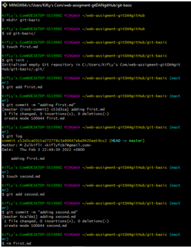
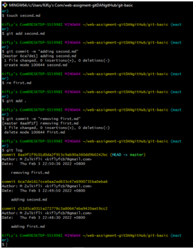

1. Create a folder called git-basic
 > mkdir git-basic
2. cd into the git-basic folder
 > cd git-basic
3. Create a file called first.txt
 > touch first.txt
4. Initialize an empty git repository
 > git init .
5. add first.txt to the staging area
 > git add first.txt
6. Commit with the message “ adding first.txt”
 > git commit -m “adding fisrt.txt”
7. Check Out your commit with git log
 >git log
8.create another file called second.txt
 >touch second.txt
9. add second.txt to the staging area
 > git add second.txt
10.Commit with the message “adding second.txt”
 > git commit -m “adding second.txt”
11. Remove the first.txt file
 > rm first.txt
12.add this change to the staging area
 > git add .

    13.Commit with the message removing “removing first.txt”
 > git commit -m “removing first.txt”
14. Check out your commits using git log
 > git log

link screenshot https://drive.google.com/drive/folders/1Dpm40bEpaOcyVoOpYChH__ubyk2p3WAF

