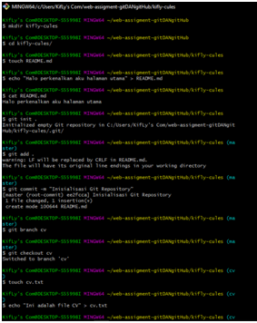
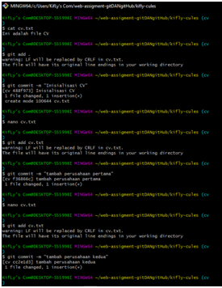
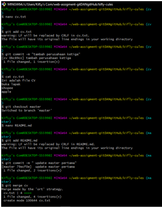
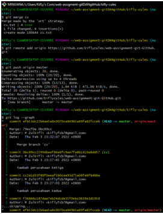
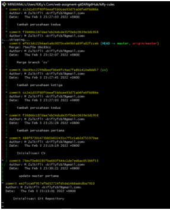

1. membuat sebuah folder kosong dengan namamu sendiri
 >mkdir kifly-cules
2. membuat sebuah file dengan nama README.md, isi file tersebut dengan kalimat
"Halo perkenalkan aku halaman utama"
 > touch README.md
 > echo "Halo perkenalkan aku halaman utama" > README.md
3. insialisasi folder tersebut dengan Git, kemudian dokumentasikan menggunakan commit dengan pesan
"Inisialisasi Git Repository"
 > git init
 >git add .
 >git commit -m "Inisialisasi Git Repository"

4. buat branch baru dengan nama cv, hal ini berguna agar histori kita tidak tercampur
 >git branch cv
 
5. pindah branch kedalam cv, kemudian buat file dengan nama cv.txt dan isi file tersebut dengan kalimat:
"Ini adalah file CV"
 >git checkout cv
 >touch cv.txt
 echo "Ini adalah file CV" > cv.txt
6. kemudian dokumentasikan menggunakan commit dengan pesan
"Inisialisasi CV"
 >git add .
 >git commit -m "Inisialisasi CV"
7. tambahkan 3 perusahaan yang akan kamu lamar, dan setiap menuliskan 1 nama perusahaan kamu harus melakukan dokumentasi menggunakan commit
 >nano add cv.txt
 buka lapak
 >git add .
 >git commit -m "tambah perusahaan pertama"
 >nano add cv.txt
 shopee
 >git add .
 >git commit -m "tambah perusahaan kedua"
 >nano add cv.txt
 apple
 >git add .
 >git commit -m "tambah perusahaan ketiga"
 >cat cv.txt
8. kembali ke branch master
 >git checkout master
9. ubah file README.md menjadi
Halo perkenalkan aku halaman utama

    Ini adalah update pertama pada branch master
jangan lupa untuk mendokumentasikannya menggunakan commit dengan pesan
"update master pertama"
 >nano README.md
 Ini adalah update pertama pada branch master
 >git add README.md
 >git commit -m "update master pertama"

10. gabungkan branch cv kedalam branch master menggunakan perintah git merge
 >git merge cv

11. unggah Git Repository tersebut kedalam GitHub
 > git remote add origin https://github.com/kiflycules/web-assignment-git-GitHub.git
> git push origin master
>git log --graph

link screenshot https://drive.google.com/drive/folders/1a_s27n4tEzay_v8epo5U07-W6RkD9RE_

